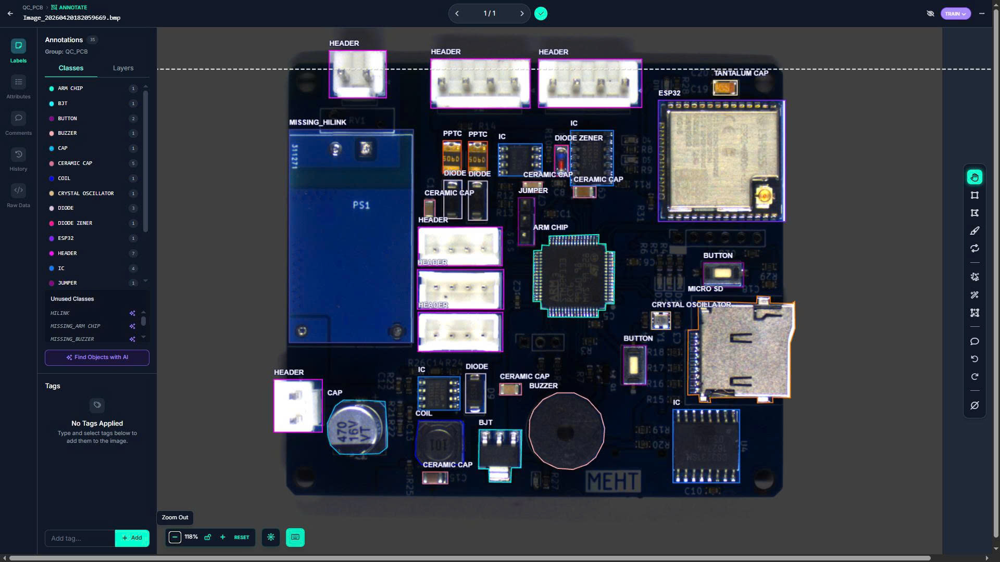
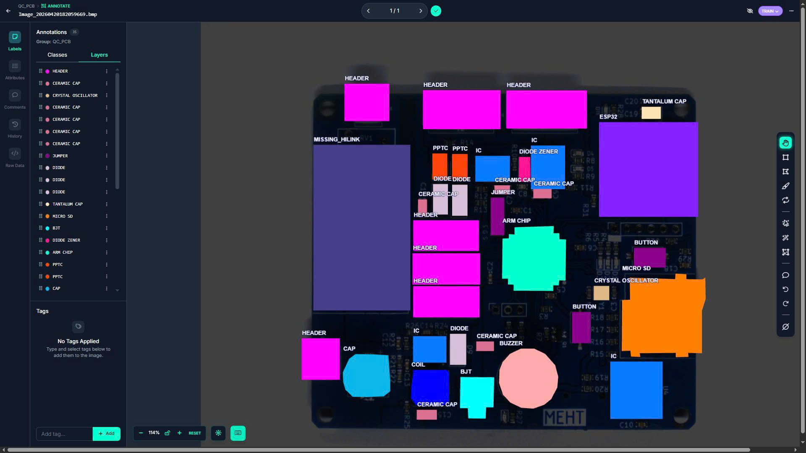

# QC_PCB: Computer Vision-Based Solution for Detecting Missing PCB Components

## 1. Project Overview
This project develops an automated Quality Control (QC) system using Artificial Intelligence to detect missing SMD components on a moving conveyor belt. It replaces manual visual inspection, ensuring high precision and consistency in electronic assembly lines.

## 2. Core Features & Problem Solving
*   **QC Automation:** Rapidly and accurately detects missing components, replacing error-prone manual labor.
*   **System Synchronization:** Synchronizes conveyor speed ($0.1 - 0.2$ m/s) with camera sampling to eliminate motion blur.
*   **Digitalized Monitoring:** Automatically logs defects, tracks OK/NG statistics, and provides a real-time monitoring interface.
*   **High Adaptability:** Features adjustable fixtures to support various PCB models (up to 80 x 80 mm).

## 3. Technical Specifications
| Parameter | Unit | Value |
| :--- | :--- | :--- |
| **Inspection Throughput** | PCBs/min | 2 - 4 |
| **Conveyor Speed** | m/s | 0.1 - 0.2 |
| **Min. Detection Size** | mm | 2.5 x 2.5 |
| **Max. PCB Workpiece Size** | mm | 80 x 80 |
| **System Footprint** | mm | 1000 x 1000 x 1000 |

  

    
    
    
Annotation

  

## 4. Project Constraints
*   **Budget:** 20,000,000 VNĐ.
*   **Timeline:** 3 months (Mechatronics Capstone Project).
*   **Environment:** Laboratory environment (Applied Mechatronic Lab - AML).

## 5. Team Members
*   **Supervisor:** Dr. Nguyen Duc Nam
*   **Team Leader:** Nguyen Duc Binh
*   **Members:** Chu Bang, Nguyen Duc Khang